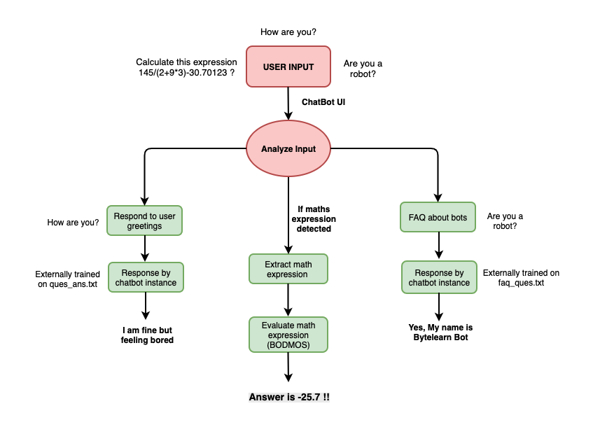

# maths-expression-calculator-chatbot

- Tested chatbot with **Python 3.8.5** version

## Setup on local web

### Installing chatbot required library

- Check how to make virtual environment and how to activate it (https://virtualenv.pypa.io/en/stable/)

```
pip install Flask
pip install chatterbot
pip install chatterbot-corpus

```

### Run the chatbot

```
python app.py
```
your chatbot will start running http://127.0.0.1:5000/ 

**DEMO VIDEO:** https://drive.google.com/drive/u/0/folders/1F0B9ffX8qjLEi5VgPrdC2miwidKQum_X




